# GAMES101-Homework(Being Updated)

Homework of GAMES101: Introduction to Computer Graphics, instructed by Professor Linqi Yan. 

## Assignment0

Build up C++ Environment (OpenCV & Eigen)

## HW1-Rotation and Translation

    

## HW2-Triangles and Z-buffering

### Normal Version

    

### MSAA Version

Implement MSAA by using supersampling to achieve anti-aliasing, and optimize the boundary, but there is a black edge at the intersection of triangles

    

### MSAA Version with no black-edge

Remove the black edge at the intersection of triangles  

    

### Comparison

    

## HW3-Shading

### Normal Shader

    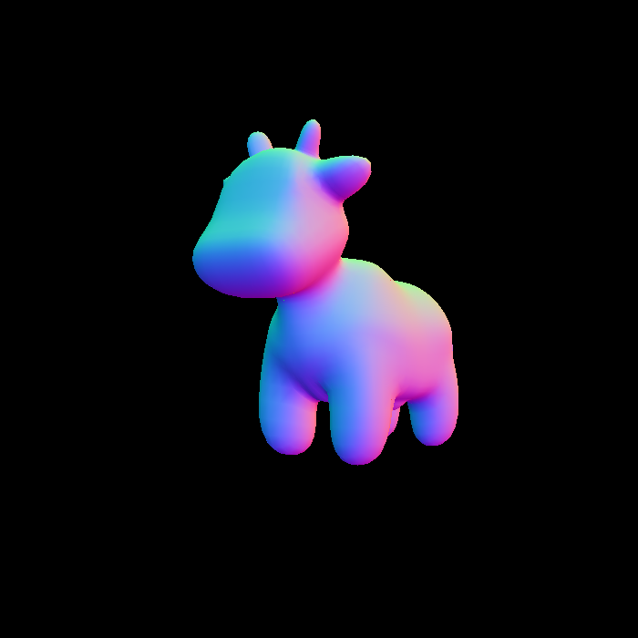

### Blinn-Phong Shader

    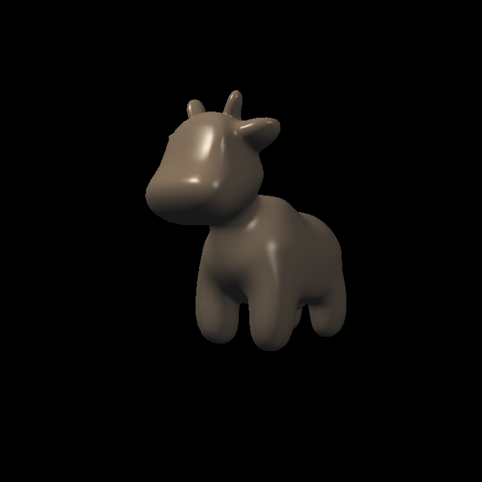

### Texture Shader

    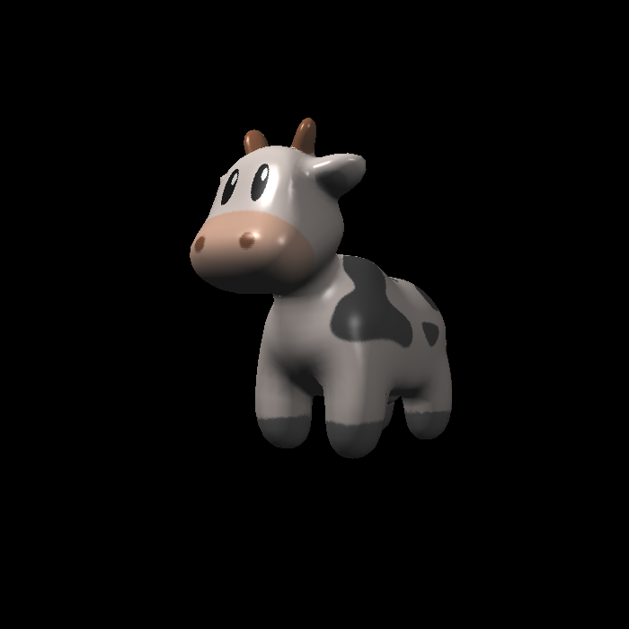

### Bump Mapping Shader

    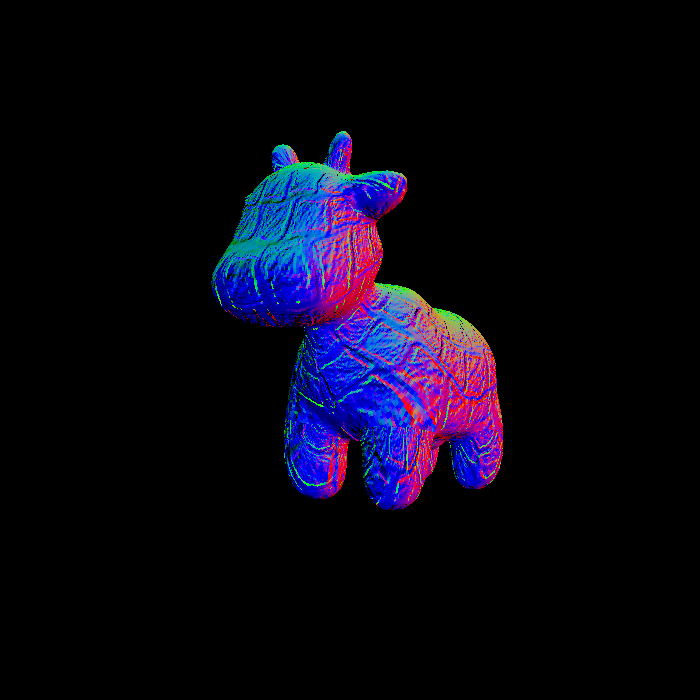

### Displacement Mapping Shader

    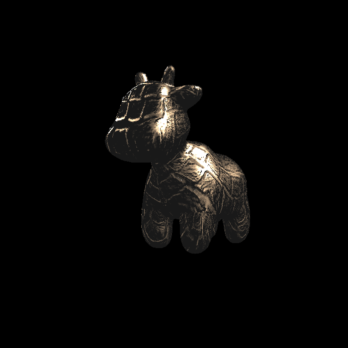

## HW4-Bezier Curve
### Naive Bezier Curves

    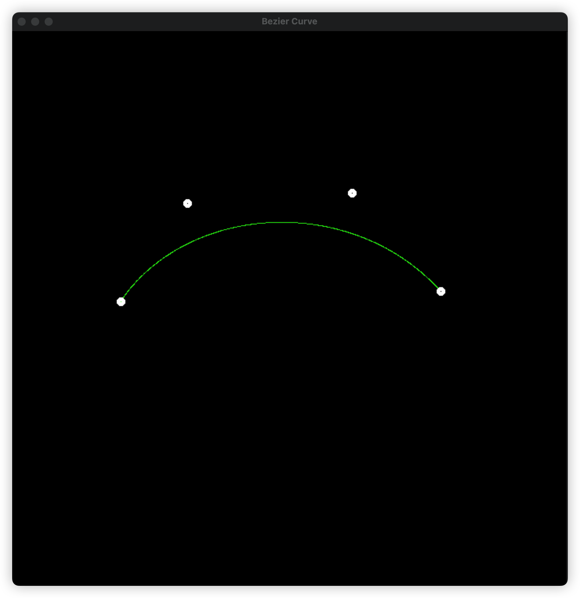

### Anti-Aliasing Bezier Curves

    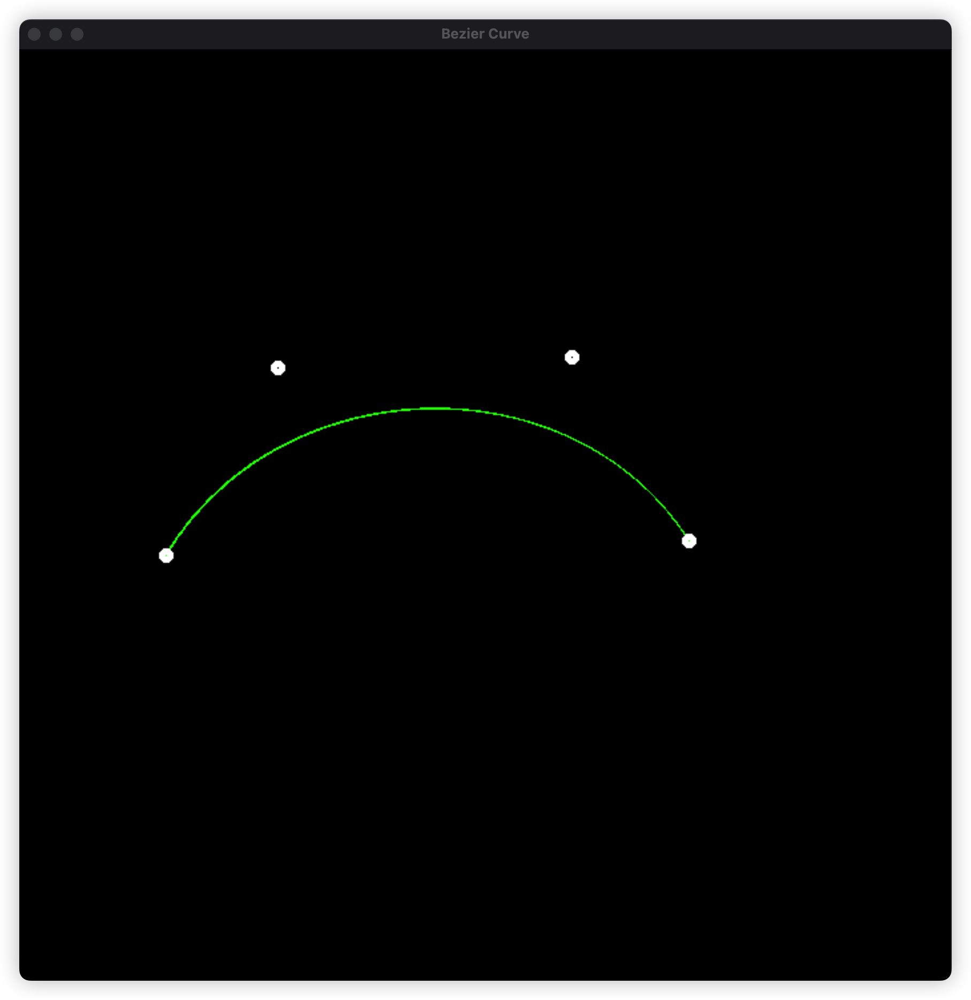

### Comparison

    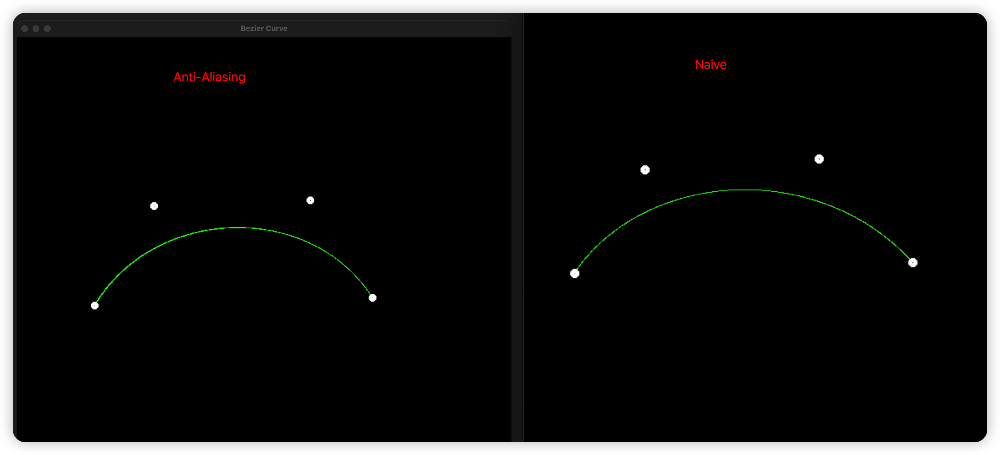

    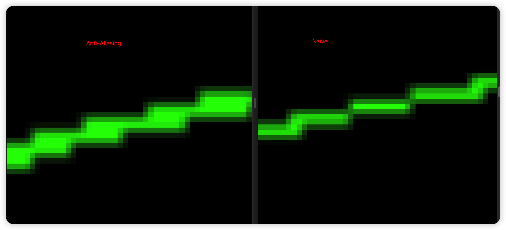

## HW5-Ray Tracing and Triangle Intersection

    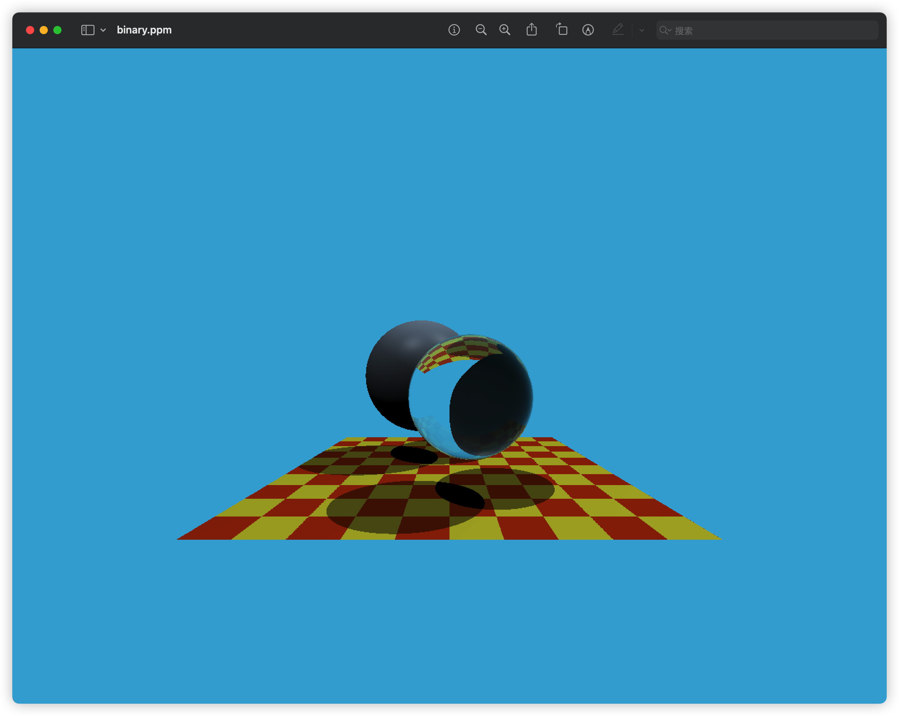

## HW6-Ray Bounding Box Intersection and BVH

    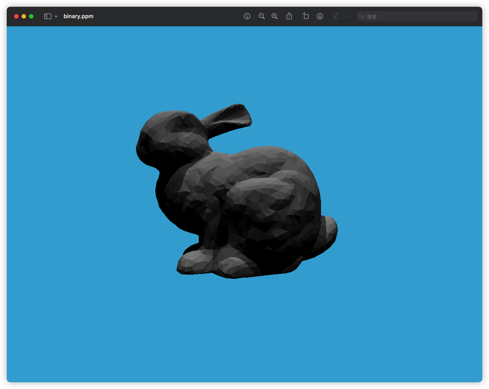

## HW7-Path Tracing
SPP = 16
Render Time = 48min

    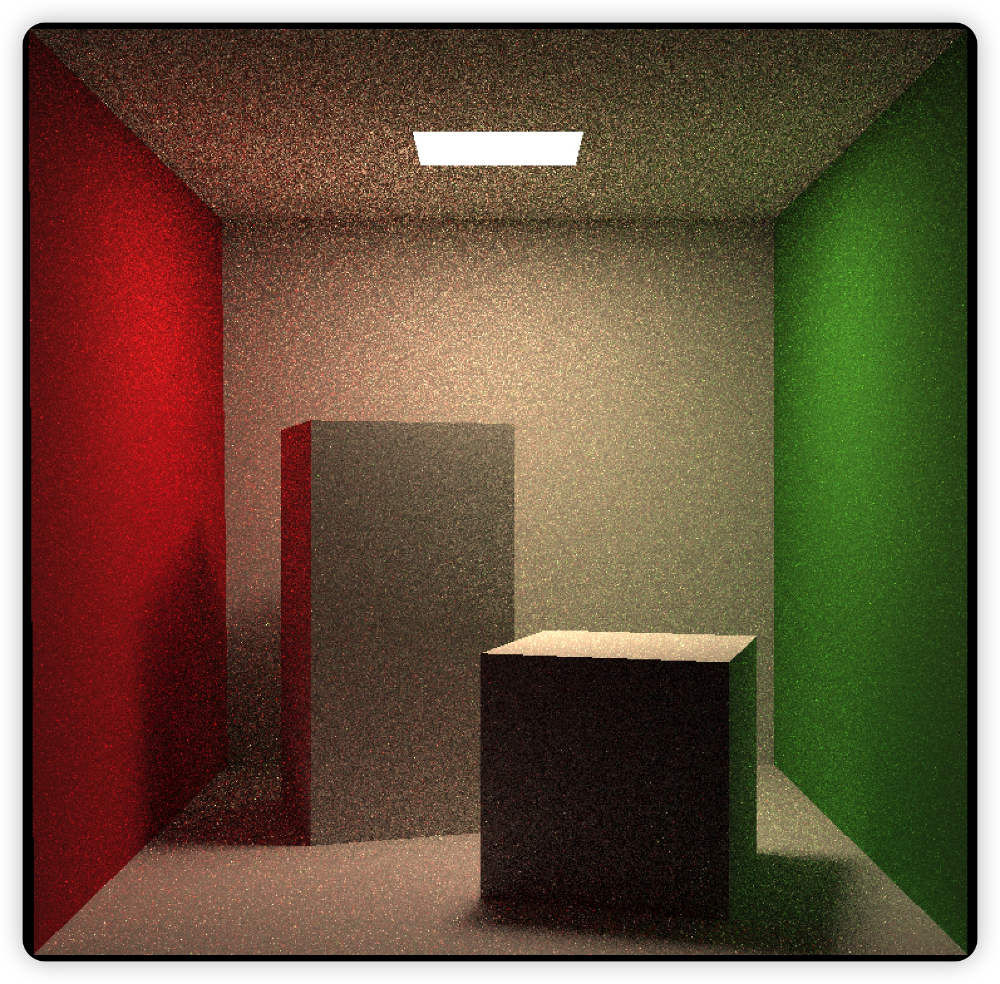

